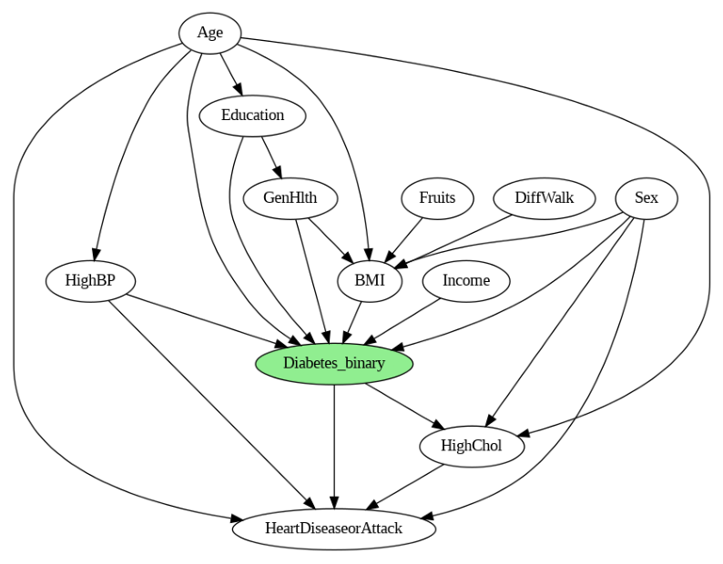

<p align="center">
  
</p>

# A Probabilistic Approach to Diabetes Risk Assessment Using Bayesian Networks

This project explores the application of **Bayesian Networks (BNs)** for diabetes risk assessment. Various Bayesian structures, including **Naïve Bayes, Hill Climbing (BIC, K2, BDeu), Simulated Annealing, and a Domain Knowledge-Based model**, are developed and evaluated to determine the most effective framework for prediction.  


## Dataset  
The dataset used in this study can be accessed here: **[Diabetes Health Indicators Dataset](https://www.kaggle.com/datasets/alexteboul/diabetes-health-indicators-dataset)**.  

## Methodology
1. **Feature Selection**: SHAP values from a trained XGBoost classifier are used to identify important features. Additionally, features are ranked based on Mutual Information (MI) to gain deeper insights into their importance.
2. **Structure Learning**: Bayesian Networks are constructed using both data-driven and domain knowledge-based approaches.
3. **Parameter Estimation**: Maximum Likelihood Estimation (MLE) is applied to estimate Conditional Probability Distributions (CPDs).
4. **Evaluation**: Models are assessed using the AUC-ROC evaluation metric to identify top-performing models.
5. **Inference**: The top Bayesian Networks are used for probabilistic reasoning, enabling predictions and risk assessments based on given evidence.

## Proposed Bayesian Network Structure  

<!--   -->


## Top-Performing Bayesian Network Structure Learned via AI Techniques
#### Hill Climbing Search with K2 Scoring Method
<!--    -->


## Repository Structure  

### Folders  
- **feature selection**  
  - `shap_and_mi.py`: Trains an XGBoost classifier on the dataset and analyzes feature importance using **SHAP values** with TreeExplainer. Then, applies Scikit-learn's mutual information to rank features and finally examines the correlation between the **top 10 features** identified by each method.

- **bayesian network modeling**  
  - `ai_based_structure_learning.py`: Data-driven Bayesian Network construction using various AI techniques.  
  - `domain_knowledge_driven.py`: Manually designs the Bayesian Network structure using insights from research literature. 
  - For both Bayesian Modeling approaches, `pgmpy` library is used.

- **evaluation & inference**  
  - `evaluation_and_inference.py`: Performs the parameter estimation using **MLE**, evaluates models using **AUC-ROC metric**, and then performs probabilistic inference using **Variable Elimination**.
 
- **models**
  - Contains saved checkpoints (.pkl) of the learned models required for the `diabetes_risk_analysis_(lightweight).ipynb` notebook.
  
- **dataset**
- `diabetes_indicators.csv`: Includes the cleaned dataset before feature selection.
- `df_selected.csv`: Provides the dataset containing only the selected features. 

## Usage  

### Install Dependencies  
Clone the repository and install required packages:  
```bash
git clone https://github.com/faezesarlakifar/Unibo-FAIKR-M3-project
cd "Unibo-FAIKR-M3-project"
pip install -r requirements.txt
apt-get install -q graphviz libgraphviz-dev pkg-config
```

Run Inference
```bash
cd "evaluation & inference"
python inference.py
```
## Notebooks
- You can directly access the main notebook with all the experiments reuslts here: [diabetes_risk_analysis_(lightweight).ipynb](diabetes_risk_analysis_(lightweight).ipynb)
- A notebook containing all existing evaluation steps (each variable elimination) is `Diabetes_Risk_Prediction.ipynb`. Since it has a large file size, a lightweight version is provided for easier exploration."

## Cool insights

### ShAP Analysis Results


Top features are selected based on this result.

### SHAP dependence plot for Education vs GenHealth


This plot suggests that individuals with higher education levels have better general health. (Education levels range from 1 _lowest_ to 6 _highest_, while GenHealth values are in reverse order, with 5 indicating the poorest health and 1 the best). More insightful plots are available in the feature engineering section of the main notebook. 🙂


